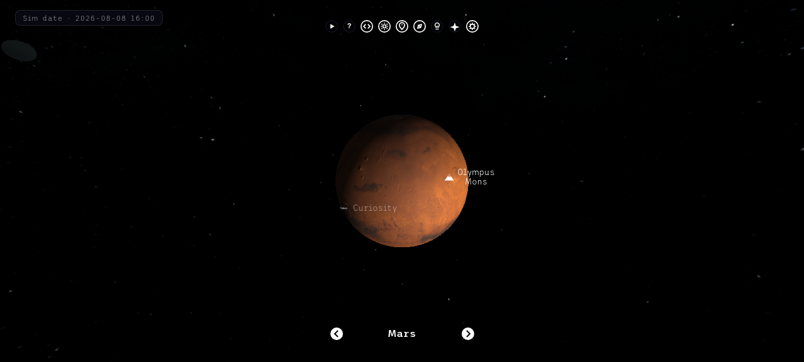

# Solar System Model

An interactive 3D model of the solar system, built with Three.js. Traverse the
planets, inspect points of interest (Olympus Mons, Apollo 11, the Great Red
Spot…), run the simulation at any speed, fly between worlds in free-roam mode,
and test yourself with the built-in quiz.

Built and maintained by [Garvit](https://github.com/garvit-pandia).

## Features

- **Orbits & moons** — the eight planets plus the Moon, Ganymede, Titan,
  Callisto, Io, Europa and Triton, all in motion
- **True-scale mode** — real sizes and real distances (1 unit = Earth's
  radius); the Sun becomes 109× Earth and space gets properly vast
- **Free-roam FPS flight** — pointer-lock mouse look, WASD movement, boost,
  adjustable speed
- **Time controls** — pause, reverse, speed presets (×0.125 … ×100) and a
  fine-grained speed slider, with a live simulated-date HUD
- **Asteroid belt** — procedurally generated main belt (three rock shapes,
  varied colours and sizes, faint dust disc) between Mars and Jupiter
- **Real ephemeris** — planets start at their actual positions based on
  J2000 mean longitudes
- **Facts cards** — radius, day length, year length, temperature, gravity,
  moons, distance and a fun fact for every body
- **Quiz mode** — six questions, answered by clicking the on-screen options
  or the planets themselves
- **Cinematic auto-tour** — a guided flight from the Sun to Neptune
- **Points of interest** — labelled surface features on Earth's Moon, Mars,
  Jupiter, Saturn and Neptune
- **Hover tooltips, click-to-focus camera, orbit paths, bloom lighting,
  atmosphere and shadows**
- **Controls & features reference** — the help button explains every button
  and simulation control

## Setup

Download [Node.js](https://nodejs.org/en/download/).
Run the following commands:

```bash
# Install dependencies
npm install

# Run the local server
npm run dev

# Build for production in the dist/ directory
npm run build
```

## Screenshots





## Data sources

- **Physical data (radii, distances, periods)** — NASA/JPL planetary fact
  sheets (mean radii, semi-major axes)
- **The Sun, Jupiter, Saturn, Uranus, and Neptune textures** -
  [https://www.solarsystemscope.com/textures/](https://www.solarsystemscope.com/textures/)
- **Terrestrial Planets textures** - [https://planetpixelemporium.com/planets.html](https://planetpixelemporium.com/planets.html)
- **Moon texture** - [https://svs.gsfc.nasa.gov/4720](https://svs.gsfc.nasa.gov/4720)
- **Ganymede texture** - [https://www.deviantart.com/askaniy/art/Ganymede-Texture-Map-11K-808732114](https://www.deviantart.com/askaniy/art/Ganymede-Texture-Map-11K-808732114)
- **Titan texture** - [https://planet-texture-maps.fandom.com/wiki/Titan](https://planet-texture-maps.fandom.com/wiki/Titan)
- **Callisto texture** - [http://bjj.mmedia.is/data/callisto/](http://bjj.mmedia.is/data/callisto/)
- **Io texture** - [https://phys.org/news/2014-12-solar-worlds-distant-exoplanets.html](https://phys.org/news/2014-12-solar-worlds-distant-exoplanets.html)
- **Europa texture** - [https://www.johnstonsarchive.net/spaceart/cylmaps.html](https://www.johnstonsarchive.net/spaceart/cylmaps.html)
- **Triton texture** - [https://www.go-astronomy.com/planets/neptune-moon-triton.htm](https://www.go-astronomy.com/planets/neptune-moon-triton.htm)
