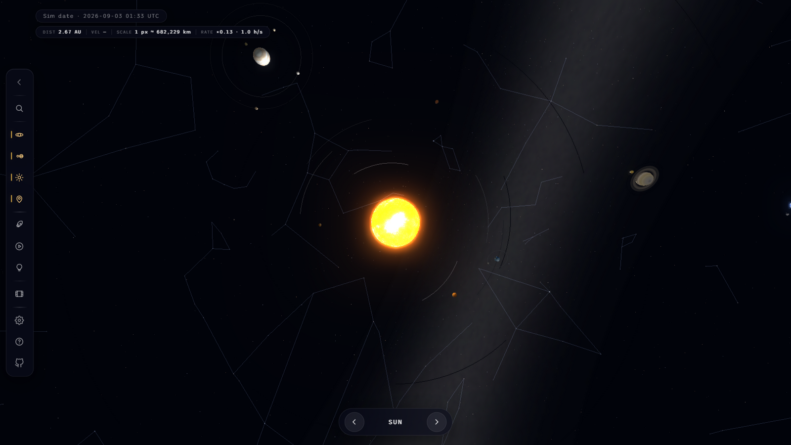
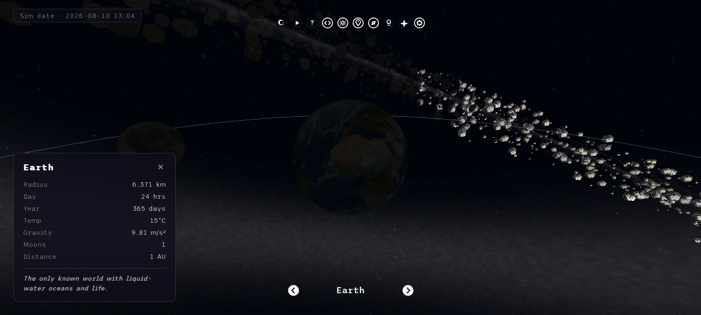
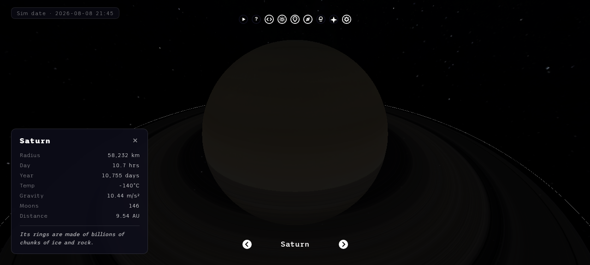
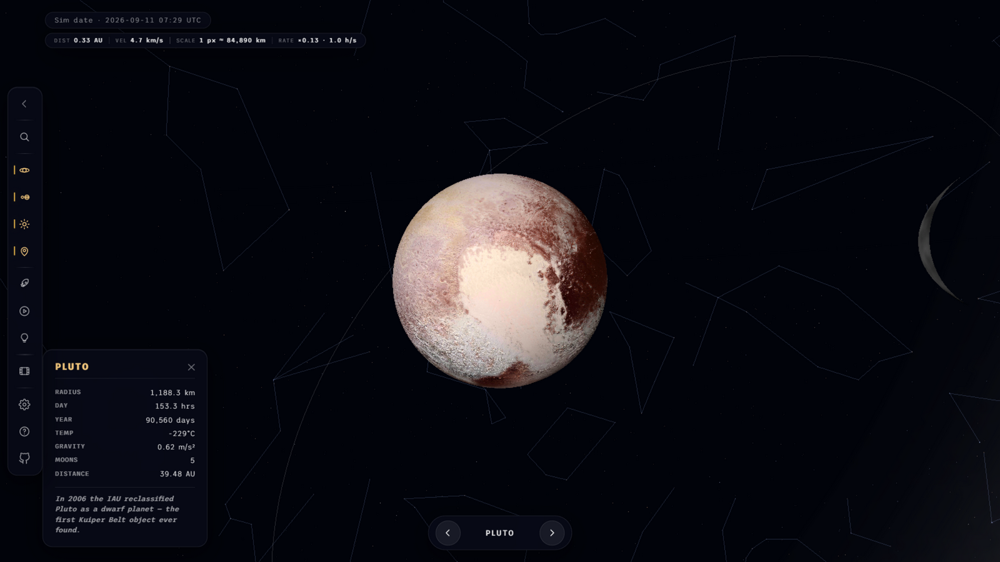
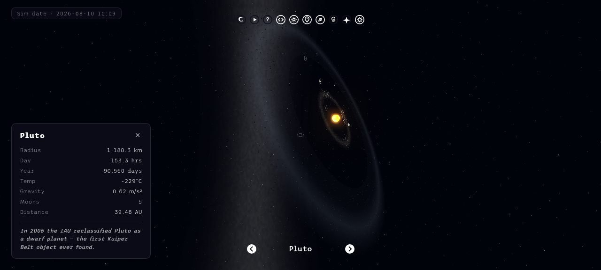
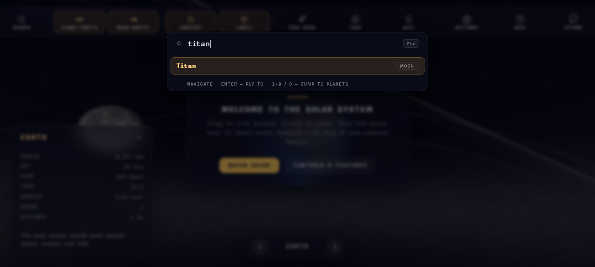
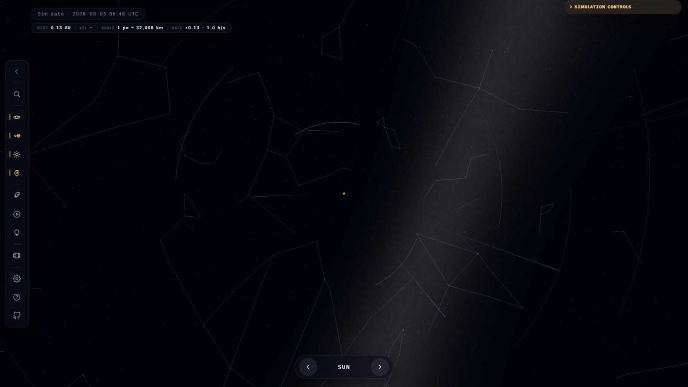

# Solar System Model

An interactive 3D model of the solar system, built with Three.js. Traverse the
planets, inspect points of interest (Olympus Mons, Apollo 11, the Great Red
Spot…), run the simulation at any speed, fly between worlds in free-roam mode,
and test yourself with the built-in quiz.

Built and maintained by [Garvit](https://github.com/garvit-pandia).

## Features

- **Orbits & moons** — the eight planets plus the Moon, Ganymede, Titan,
  Callisto, Io, Europa and Triton, all in motion
- **Dwarf planets & the Kuiper belt** — Pluto (with Charon), Ceres, Eris,
  Makemake and Haumea, plus the icy 30–50 AU Kuiper belt (optional, like
  the main belt)
- **Search & quick-nav** — Ctrl+K (or the magnifier button) opens a
  fuzzy-search palette over all 23 bodies; number keys 1–9/0 jump
  straight to the classic planets
- **Procedural starfield** — 10,000 temperature-tinted, twinkling stars
  plus a subtle Milky Way band
- **True-scale mode** — real sizes and real distances (1 unit = Earth's
  radius); the Sun becomes 109× Earth and space gets properly vast
- **Free-roam FPS flight** — pointer-lock mouse look, WASD movement, boost,
  adjustable speed
- **Time controls** — pause, reverse, speed presets (×0.125 … ×100) and a
  fine-grained speed slider, with a live simulated-date HUD
- **Asteroid belt** — procedurally generated main belt (three rock shapes,
  varied colours and sizes, faint dust disc) between Mars and Jupiter
- **Real ephemeris** — planets start at their actual positions based on
  J2000 mean longitudes
- **Facts cards** — radius, day length, year length, temperature, gravity,
  moons, distance and a fun fact for every body
- **Quiz mode** — six questions, answered by clicking the on-screen options
  or the planets themselves
- **Cinematic auto-tour** — a guided flight from the Sun to Neptune
- **Points of interest** — labelled surface features on Earth's Moon, Mars,
  Jupiter, Saturn and Neptune
- **Hover tooltips, click-to-focus camera, orbit paths, bloom lighting,
  atmosphere and shadows**
- **Sun-direction lighting** — the Sun actually lights the planets (day
  sides, night terminators) instead of ambient-only flat shading
- **Sim date on the J2000 epoch** — the HUD date always matches the planet
  positions (1 Jan 2000 + elapsed time; pause/reverse/speed aware)
- **Free-roam FPS flight** — first-person WASD flight that remembers your
  position: exit and re-enter, and you continue where you left off. The
  toolbar stays clickable mid-flight (no pointer lock)
- **Separate orbit-ring toggles** — one for the planets' rings around the
  Sun, one for the moons' rings around their planets
- **Controls & features reference** — the help button explains every button
  and simulation control

## Setup

Download [Node.js](https://nodejs.org/en/download/).
Run the following commands:

```bash
# Install dependencies
npm install

# Run the local server
npm run dev

# Build for production in the dist/ directory
npm run build
```

## Screenshots









## Data sources

- **Physical data (radii, distances, periods)** — NASA/JPL planetary fact
  sheets (mean radii, semi-major axes)
- **The Sun, Jupiter, Saturn, Uranus, and Neptune textures** -
  [https://www.solarsystemscope.com/textures/](https://www.solarsystemscope.com/textures/)
- **Terrestrial Planets textures** - [https://planetpixelemporium.com/planets.html](https://planetpixelemporium.com/planets.html)
- **Pluto & Charon textures** — NASA New Horizons global maps (public
  domain, via Wikimedia Commons)
- **Ceres, Eris, Makemake & Haumea textures** —
  [https://www.solarsystemscope.com/textures/](https://www.solarsystemscope.com/textures/)
  (CC BY 4.0; reconstructed maps — no full-resolution surface imaging
  exists for these worlds yet)
- **Ganymede texture** - [https://www.deviantart.com/askaniy/art/Ganymede-Texture-Map-11K-808732114](https://www.deviantart.com/askaniy/art/Ganymede-Texture-Map-11K-808732114)
- **Titan texture** - [https://planet-texture-maps.fandom.com/wiki/Titan](https://planet-texture-maps.fandom.com/wiki/Titan)
- **Callisto texture** - [http://bjj.mmedia.is/data/callisto/](http://bjj.mmedia.is/data/callisto/)
- **Io texture** - [https://phys.org/news/2014-12-solar-worlds-distant-exoplanets.html](https://phys.org/news/2014-12-solar-worlds-distant-exoplanets.html)
- **Europa texture** - [https://www.johnstonsarchive.net/spaceart/cylmaps.html](https://www.johnstonsarchive.net/spaceart/cylmaps.html)
- **Triton texture** - [https://www.go-astronomy.com/planets/neptune-moon-triton.htm](https://www.go-astronomy.com/planets/neptune-moon-triton.htm)
